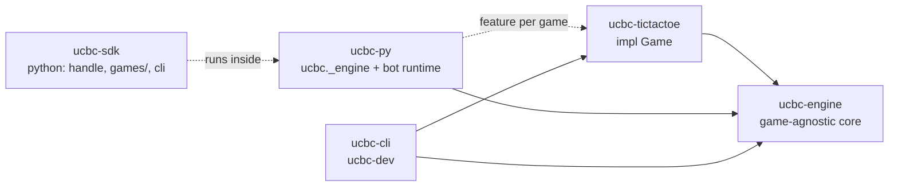
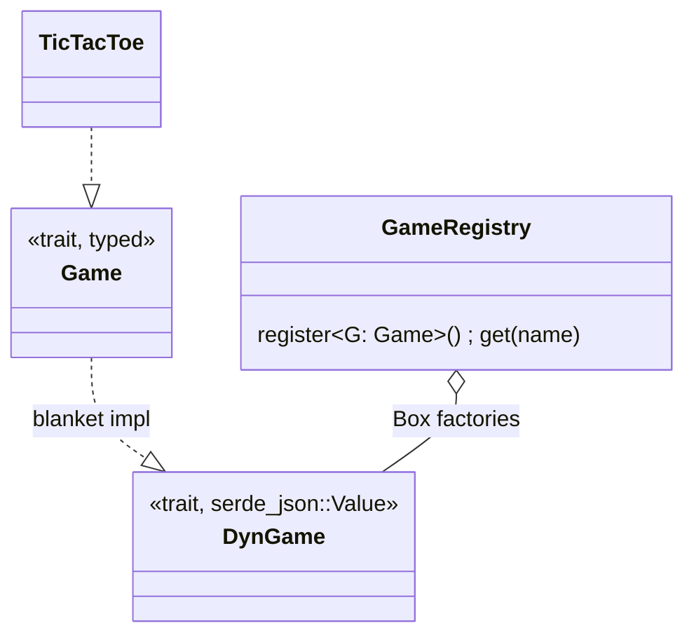
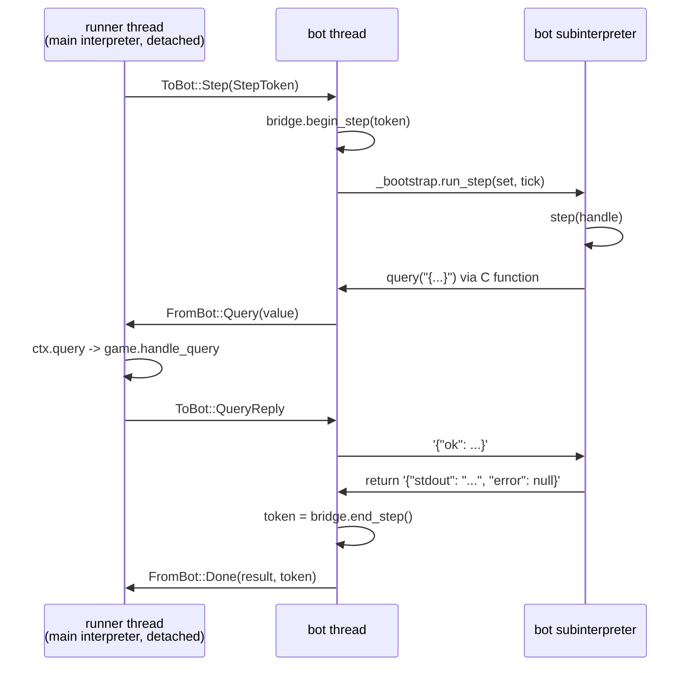

# Engine

## Crates



## Vocabulary

```text
match  = sets            (first team rotates each set)
set    = ticks           (game.status() Complete, or max_ticks -> draw)
tick   = one run of game.schedule()
step   = one bot's turn within a tick
team   = one code submission; owns many bots
bot    = one unit the game asks to step; own runtime, own namespace
```

## Match loop

```mermaid
flowchart TD
    A[for set in 0..sets] --> B[game = Game::create]
    B --> C{status Complete<br/>or tick == max_ticks?}
    C -- yes --> Z[SetResult]
    C -- no --> D[schedule = game.schedule]
    D --> E[for bot in schedule]
    E --> G[registry.bot_mut: spawn on first use]
    G --> H[bot.step&#40;StepCtx&#41;]
    H -- Ok --> I[game.end_step]
    H -- Err --> J[registry.despawn<br/>game.bot_failed]
    I --> K[drain game.despawned]
    J --> K
    K --> L[record Step]
    L --> E
    E -- done --> M[game.end_tick unless Complete]
    M --> N[record Tick + snapshot]
    N --> C
```



## Game trait

```rust
pub trait Game: Send + 'static {
    const NAME: &'static str;
    type Query: DeserializeOwned + JsonSchema;       // #[serde(tag = "type")] enum
    type QueryResponse: Serialize + JsonSchema;
    type Action: DeserializeOwned + JsonSchema;      // #[serde(tag = "type")] enum
    type ActionResponse: Serialize + JsonSchema;
    type Snapshot: Serialize + JsonSchema;

    fn create(setup: &SetSetup) -> Result<Self, EngineError>;
    fn schedule(&mut self) -> Vec<BotRef>;
    fn handle_query(&self, bot: BotRef, query: Self::Query) -> Result<Self::QueryResponse, QueryError>;
    fn apply_action(&mut self, bot: BotRef, action: Self::Action) -> Result<Self::ActionResponse, ActionError>;
    fn end_step(&mut self, bot: BotRef);
    fn bot_failed(&mut self, bot: BotRef, failure: &BotFailure);
    fn end_tick(&mut self);
    fn despawned(&mut self) -> Vec<BotId> { Vec::new() }
    fn status(&self) -> GameStatus;
    fn snapshot(&self) -> Self::Snapshot;
}
```

Games never see JSON. `DynGame` (blanket impl) decodes and encodes at the boundary.



Registration:

```rust
let mut registry = GameRegistry::new();
registry.register::<TicTacToe>();
```

## Bot trait

```rust
pub trait Bot: Send {
    fn step(&mut self, ctx: &mut StepCtx<'_>) -> StepResult;
    fn shutdown(&mut self) {}
}

pub type BotFactory = Box<dyn FnMut(&SpawnCtx) -> Result<Box<dyn Bot>, BotFailure> + Send>;

TeamSpec::new(name, factory)
TeamSpec::rust(name, |ctx: &SpawnCtx| MyBot)
TeamSpec::unavailable(name, failure)   // every bot fails at its first step
```

Bots are created lazily when the game first schedules them, and released on
`despawned()` or at set end. A released id stays dead for the set.

## StepCtx: the bot's only view of the game

```rust
pub struct StepCtx<'a> {
    pub bot: BotRef,
    pub team: &'a TeamInfo,
    pub set_index: u32,
    pub tick: u32,
    pub seed: u64,
    // private: &mut dyn DynGame, accepted actions
}

ctx.query(&json!({"type": "board"}))?;              // read-only
ctx.act(&json!({"type": "place", "row": 0, "col": 2}))?;  // Err = rejected, state unchanged
ctx.status();
```

```text
ActionError::Invalid / UnknownType / Malformed  -> bot may try again
ActionError::SetOver                             -> set already complete
BotFailure::Exception / Crash                    -> engine drops the bot, game.bot_failed decides
```

## Python bots

One subinterpreter per bot, own GIL. PyO3 objects never enter it; the bridge is two
C functions and JSON strings.



Lifecycle of a bot thread:

```text
memory::enter(limit)       this thread's allocations count against the bot
Interp::create()           PyGILState_Ensure -> Py_NewInterpreterFromConfig -> swap back -> Release
attached(boot)             import ucbc._bootstrap; bridge functions
send Started(Warden)       the warden thread, through which the runner freezes and thaws the bot
attached(load)             _b.load(SOURCE, PATH, IDENTITY, BRIDGE)      under the step budget
loop recv Step             attached(_b.run_step(SET_INDEX, TICK))       under the step budget
Shutdown                   Interp::destroy() -> Py_EndInterpreter
runner gone                return; the interpreter stays alive (abandoned bot, warden holds its GIL)
```

The runner waits `step_time` for `Loaded`/`Done`, then has the warden freeze the bot by
taking its GIL. The bot's next turn thaws it and ends when that work returns.
See [resourcelimits.md](resourcelimits.md).

Interpreter config:

```rust
PyInterpreterConfig {
    use_main_obmalloc: 0,
    allow_fork: 0,
    allow_exec: 0,
    allow_threads: 0,
    allow_daemon_threads: 0,
    check_multi_interp_extensions: 1,
    gil: PyInterpreterConfig_OWN_GIL,
}
```

## StepToken

```mermaid
stateDiagram-v2
    [*] --> Runner: StepToken::new (per step, not Clone)
    Runner --> Bridge: ToBot::Step
    Bridge --> Bridge: query/act allowed
    Bridge --> Runner: FromBot::Done
    Runner --> [*]: dropped
```

No token in the bridge: `query`/`act` raise `RuntimeError("no step in progress")`.
While a set ends the runner answers every call with `StepOver`: `RuntimeError("the step
is over")`. At most one live token exists in the process at a time.

## Inside the interpreter

```text
ucbc/_bootstrap.py   load(source, path, identity, bridge) -> failure json | null
                     run_step(set_index, tick) -> json {"stdout", "error"}
ucbc/handle.py       Identity(bot_id, team, team_name, seed, game)
                     Handle(identity, bridge): _query(dict) -> dict, _act(dict) -> dict
                     QueryError, ActionError, SetOver
ucbc/games/<g>.py    class <G>Handle(Handle); HANDLE = <G>Handle
```

`bridge` is a dict `{"query": fn, "act": fn}` of C functions bound to the bot's `Bridge`.

Bridge reply format:

```json
{"ok": {...}}
{"err": {"kind": "query" | "action" | "set_over", "message": "..."}}
```

## Replay

```text
Replay { match_id, engine_version, config { game, sets, seed, teams, max_ticks, limits, game_config? }, teams, sets[], result }
  SetReplay { index, first_team, initial_state, ticks[], result }
    Tick { number, steps[], state_after }
      Step { bot, team, actions[], stdout, failure?, usage: { time_us, memory? } }
    SetResult { index, first_team, winner_team?, reason: win|draw|forfeit, detail, ticks }
  MatchResult { sets[], set_wins[], winner_team? }
```

Deterministic for a fixed seed except `usage`: no timestamps, sorted JSON keys, ChaCha8
seeds (`set_seed(match_seed, set)`, `bot_seed(set_seed, bot)`).

## Adding a game

```text
ucbc-foo/src/game.rs                  impl Game for Foo { const NAME = "foo"; ... }
                                      every Query/Action/Response/Snapshot type derives JsonSchema
ucbc-py/Cargo.toml                    foo = ["dep:ucbc-foo"]     (+ in default)
ucbc-py/src/lib.rs                    #[cfg(feature = "foo")] registry.register::<ucbc_foo::Foo>();
ucbc-cli/src/main.rs                  registry.register::<Foo>();
ucbc-sdk/ucbc/games/foo/_api.py       generated by `make sdk` (ucbc-dev gen-sdk): FooApi(Handle) with
                                      one method per query and action, one class per response type
ucbc-sdk/ucbc/games/foo/__init__.py   class FooHandle(FooApi): conveniences; HANDLE = FooHandle
bots/foo/<name>/main.py               def step(handle: FooHandle) -> None: ...
ucbc-foo/viewer/                      renderer (npm workspace); types in ucbc-viewer/scripts/gen-types.mjs,
                                      registered in ucbc-viewer/src/app.ts; `make viewer-types` regenerates
```

`ucbc-dev api foo` prints the schemas the generator reads. `make lint` fails when a
generated module is out of date.

```bash
make dev && uv run ucbc run bots/foo/a bots/foo/b
make wheels GAME=foo                             # single-game engine + SDK in dist/
```
