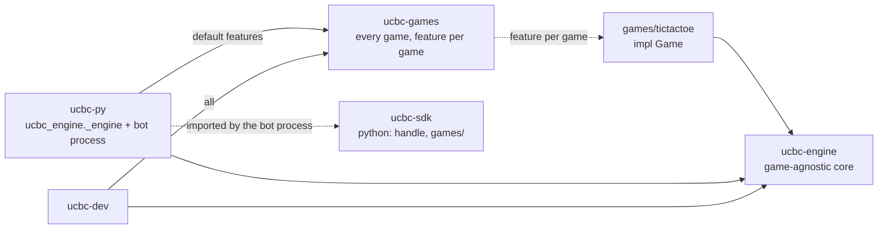
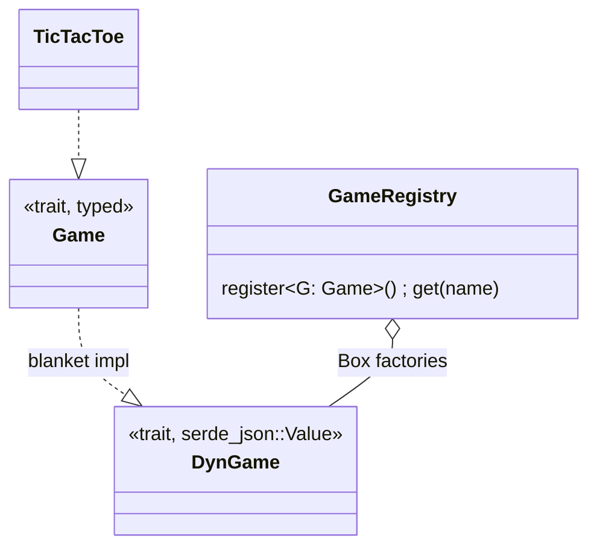
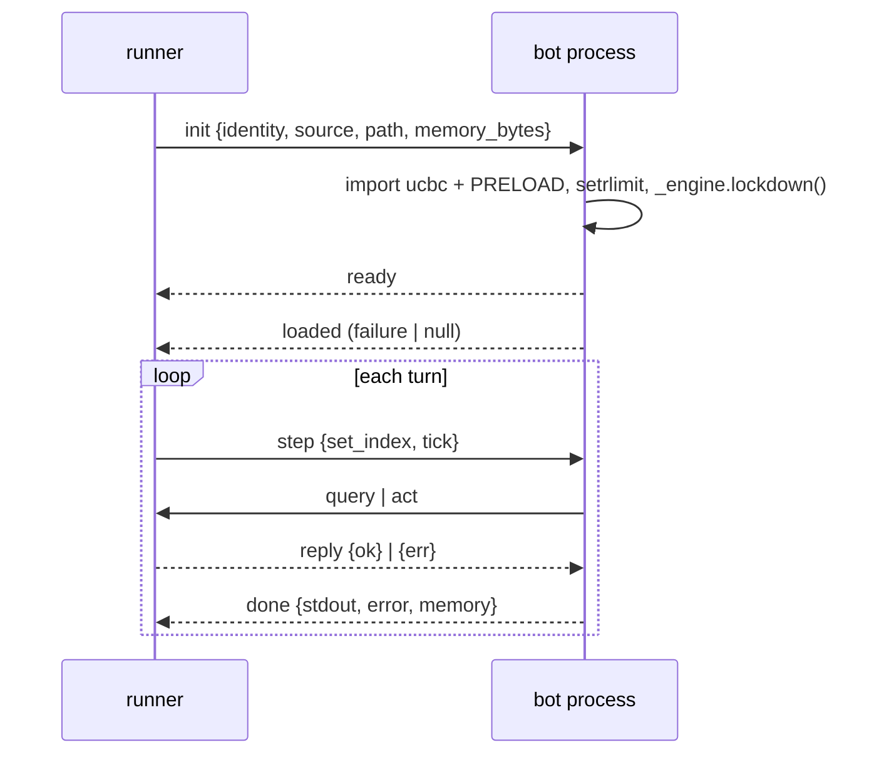

# Engine

## Crates



## Vocabulary

```text
match  = sets            (first team rotates each set)
set    = ticks           (game.status() Complete, or max_ticks -> game.tick_limit())
tick   = one run of game.schedule()
step   = one bot's turn within a tick
team   = one code submission; owns many bots
bot    = one unit the game asks to step; own runtime, own namespace
```

## Match loop

```mermaid
flowchart TD
    A[for set in 0..sets] --> B[game = Game::create]
    B --> C{status Complete<br/>or tick == max_ticks?}
    C -- yes --> Z[SetResult<br/>at max_ticks: game.tick_limit]
    C -- no --> D[schedule = game.schedule]
    D --> E[for bot in schedule]
    E --> G[registry.bot_mut: spawn on first use]
    G --> H[bot.step&#40;StepCtx&#41;]
    H -- Ok --> I[game.end_step]
    H -- Err --> J[registry.despawn<br/>game.bot_failed]
    I --> K[drain game.despawned]
    J --> K
    K --> L[record Step]
    L --> E
    E -- done --> M[game.end_tick unless Complete]
    M --> N[record Tick + snapshot]
    N --> C
```



## Game trait

```rust
pub trait Game: Send + 'static {
    const NAME: &'static str;
    type Query: DeserializeOwned + JsonSchema;       // #[serde(tag = "type")] enum
    type QueryResponse: Serialize + JsonSchema;
    type Action: DeserializeOwned + JsonSchema;      // #[serde(tag = "type")] enum
    type ActionResponse: Serialize + JsonSchema;
    type Snapshot: Serialize + JsonSchema;

    fn create(setup: &SetSetup) -> Result<Self, EngineError>;
    fn schedule(&mut self) -> Vec<BotRef>;
    fn handle_query(&self, bot: BotRef, query: Self::Query) -> Result<Self::QueryResponse, QueryError>;
    fn apply_action(&mut self, bot: BotRef, action: Self::Action) -> Result<Self::ActionResponse, ActionError>;
    fn end_step(&mut self, bot: BotRef);
    fn bot_failed(&mut self, bot: BotRef, failure: &BotFailure);
    fn end_tick(&mut self);
    fn despawned(&mut self) -> Vec<BotId> { Vec::new() }
    fn status(&self) -> GameStatus;
    fn tick_limit(&self, max_ticks: u32) -> Outcome { Outcome::draw(..) }
    fn snapshot(&self) -> Self::Snapshot;
}
```

Games never see JSON. `DynGame` (blanket impl) decodes and encodes at the boundary.



Registration:

```rust
let mut registry = GameRegistry::new();
registry.register::<TicTacToe>();
```

## Bot trait

```rust
pub trait Bot: Send {
    fn step(&mut self, ctx: &mut StepCtx<'_>) -> StepResult;
    fn shutdown(&mut self) {}
}

pub type BotFactory = Box<dyn FnMut(&SpawnCtx) -> Result<Box<dyn Bot>, BotFailure> + Send>;

TeamSpec::new(name, factory)
TeamSpec::rust(name, |ctx: &SpawnCtx| MyBot)
TeamSpec::unavailable(name, failure)   // every bot fails at its first step
```

Bots are created lazily when the game first schedules them, and released on
`despawned()` or at set end. A released id stays dead for the set.

## StepCtx: the bot's only view of the game

```rust
pub struct StepCtx<'a> {
    pub bot: BotRef,
    pub team: &'a TeamInfo,
    pub set_index: u32,
    pub tick: u32,
    pub seed: u64,
    // private: &mut dyn DynGame, accepted actions
}

ctx.query(&json!({"type": "board"}))?;              // read-only
ctx.act(&json!({"type": "place", "row": 0, "col": 2}))?;  // Err = rejected, state unchanged
ctx.status();
```

```text
ActionError::Invalid / UnknownType / Malformed  -> bot may try again
ActionError::SetOver                             -> set already complete
BotFailure::Exception / Crash                    -> engine drops the bot, game.bot_failed decides
```

## Python bots

One process per bot: `python -m ucbc_engine._bot` (`ucbc-py/src/process.rs`,
`ucbc_engine/_bot.py`), line-delimited JSON over its stdin and stdout. The process
is the unit of isolation: `RLIMIT_AS` for memory, `SIGSTOP` at the step deadline,
`SIGKILL` on despawn. See [resourcelimits.md](resourcelimits.md).



Inside the process: `_bot.py` takes the real stdin/stdout for the link before
`main.py` runs, buffers the bot's prints, and after `lockdown()` the process can open
no files, so a bot may import only `ucbc` and the stdlib modules in `PRELOAD`.
`ucbc.handle.Handle` wraps the link as `_query(dict)` and `_act(dict)`;
`ucbc.games.<g>.HANDLE` is the typed subclass a bot's `step` receives.

Reply format:

```json
{"ok": {...}}
{"err": {"kind": "query" | "action" | "set_over", "message": "..."}}
```

## Replay

```text
Replay { match_id, engine_version, config { game, sets, seed, teams, max_ticks, limits, game_config? }, teams, sets[], result }
  SetReplay { index, first_team, initial_state, ticks[], result }
    Tick { number, steps[], state_after }
      Step { bot, team, actions[], stdout, failure?, usage: { time_us, memory? } }
    SetResult { index, first_team, winner_team?, reason: win|draw|forfeit, detail, ticks }
  MatchResult { sets[], set_wins[], winner_team? }
```

Deterministic for a fixed seed except `usage`: no timestamps, sorted JSON keys, ChaCha8
seeds (`set_seed(match_seed, set)`, `bot_seed(set_seed, bot)`).

## Adding a game

A game is a folder under `games/`, listed once in `ucbc-games`:

```text
games/foo/src/                        crate ucbc-foo: impl Game for Foo { const NAME = "foo"; ... },
                                      every Query/Action/Response/Snapshot type derives JsonSchema
games/foo/viewer/                     package @ucbc/viewer-foo exporting `renderer`
ucbc-games/Cargo.toml                 foo = ["dep:ucbc-foo"], the path dependency, and foo in `all`
ucbc-games/src/lib.rs                 #[cfg(feature = "foo")] registry.register::<ucbc_foo::Foo>();
```

Then `npm install` links the renderer, and `make gen` writes `ucbc-sdk/ucbc/games/foo/`:
`_api.py` (`FooApi(Handle)`, one method per query and action, one class per response
type) every time, and a starter `__init__.py` (`FooHandle(FooApi)`, `HANDLE`) once, to add
conveniences to. Sample bots go in `bots/foo/<name>/main.py`. Everything else, from the
workspaces and the viewer bundle to the Docker images, finds the game by its folder.

`ucbc-dev api foo` prints the schemas the generator reads. Both generated files are
committed; `make gen` (run by `dev`, `lint`, `test`, `viewer`, `web`) rewrites them, so a
stale one shows up in `git status` after any of those.

`default = [...]` in `ucbc-games/Cargo.toml` is the one place that picks what a build
includes; `GAMES=` overrides it for one command:

```bash
make dev GAMES=foo && uv run ucbc run bots/foo/a bots/foo/b
make wheels GAMES=foo                            # engine + SDK with foo alone in dist/
```
