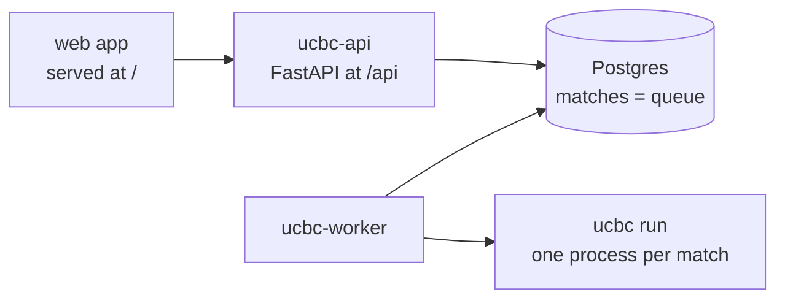
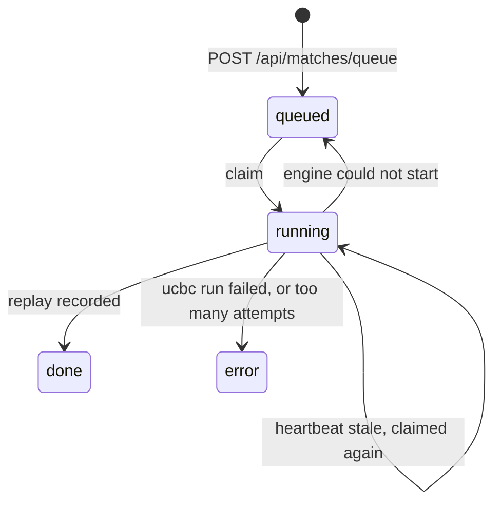

# Platform

Two images from root Dockerfiles: `Dockerfile.api` (API plus the built web app) and
`Dockerfile.worker` (API package plus the engine wheel). `compose.yaml` runs `db`, `api`, `worker`.

## Queue

A match row is the queue entry.

A worker claims with `for update skip locked`, heartbeats while the engine runs, and writes
the sets and result in one transaction. `(id, claimed_at)` is the lease: a stale heartbeat
lets another worker take the match, after which the old holder's writes match no row.

`matches.bots` names each bot's code: `{kind: "path", path}` today, object storage later
(`api/models/matches.py`, `worker/match.py::fetch`). `worker/match.py::command` is the one
place the engine process is described.

## Settings

`UCBC_` variables from `.env`, then `.env.local` or `.env.prod`: `DATABASE_URL`, `API_HOST`,
`API_PORT`, `WORKER_SLOTS`, `WORKER_POLL_S`, `WORKER_HEARTBEAT_S`, `WORKER_LEASE_S`,
`WORKER_NAME`.
