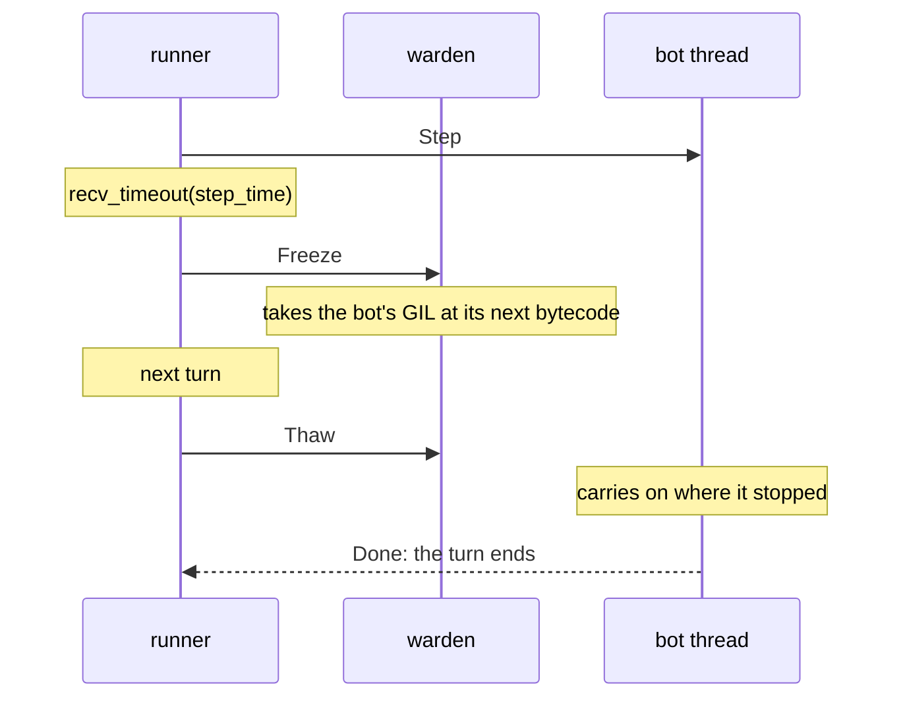

# Resource limits

Every match says what one bot may use; games have no say. The engine carries it to
the bot's runtime, which enforces it, and records it in the replay.

```rust
// ucbc-engine: bot/mod.rs
pub struct BotResourceLimit {
    pub step_ms: u64,          // wall clock, per step and for loading main.py
    pub memory_bytes: u64,     // what the bot's interpreter may hold
}

MatchConfig::new("tictactoe", 3, seed, 2, BotResourceLimit::new(50, 256 << 20))
```

```bash
uv run ucbc run a/ b/ --step-ms 50 --memory-mb 256          # defaults: 500 ms, 1024 MiB
cargo run -p ucbc-cli -- run --step-ms 50 --memory-mb 256   # same defaults
```

```python
run_match("a", "b", step_ms=50, memory_bytes=256 * 2**20)   # defaults in ucbc.runner
```

The engine enforces nothing itself, python only (rust test bots not impacted)

## Time

The clock is wall-clock time while the bot has control: from sending `Step` until
`Done` comes back, minus the time the engine spends answering the bot's queries and
actions (`StepCtx::engine_time`). Loading `main.py` gets its own budget of the same
size before the first step; interpreter start-up is engine time and not budgeted.

A bot past its deadline is frozen, not interrupted. Its warden, one thread per bot,
takes the interpreter's GIL and keeps it, so the bot stops at its next bytecode
boundary holding no lock anyone else needs. The step ends there: whatever the bot
already did stands, nothing more happens, and the replay records an ordinary step with
no failure and `time_us` at the budget. What the game makes of an empty step is the
game's business; tic-tac-toe forfeits "did not place a mark".



On the bot's next turn the warden lets go and the bot carries on where it stopped; the
turn ends when that work returns, so `step` is not called again until the turn after.
An overrun of any length therefore costs two turns. A message the bot sent just as it
was frozen waits and is answered on that next turn, so a late action lands there.

The handover waits one switch interval, so `sys.setswitchinterval` is removed from bot
interpreters. A C call (`time.sleep`, a big `sorted`, a catastrophic regex) delays it
until the call returns. A bot that is silent for a whole further turn while a freeze
still has not landed is inside a call that will not return, and is abandoned: it fails
with `crash: did not stop within a step of the time limit`, runs at idle priority
until the call returns, and is then frozen for good.

When a set ends while a bot is frozen, the warden raises `SystemExit` in it and lets
go; the bot's calls are refused with `RuntimeError("the step is over")`, the bootstrap
catches the exit, and the interpreter ends normally. A bot that still has not
returned after 1 s is abandoned: frozen for good, its interpreter alive until the
process exits. `ucbc run` then ends with `os._exit`, because CPython aborts when
finalized with a live subinterpreter, and `_engine.abandoned_bots()` counts them.

## Memory

Counted: everything Python's allocator hands out in the bot's interpreter, from its
creation. Small objects are counted by the 1 MiB arenas that hold them, larger blocks
by their real size, so fragmentation counts and a freed object may not free its arena.
Not counted: memory a C extension takes with its own `malloc` or `mmap`. The container
is the security boundary for that.

```text
PyObject_SetArenaAllocator   arena alloc/free, sizes given       -> charge / release
PyMem_SetAllocator(RAW)      malloc/calloc/realloc/free          -> charge / release
                             sizes from malloc_usable_size
thread-local Budget          set on the bot thread; other threads pass through
```

The allocation that would cross the limit fails, and the bot sees `MemoryError` where
it happened. If the objects that filled the budget are still referenced while the
error is reported, reporting itself may run out; the step then fails as
`crash: bootstrap step failed: MemoryError`. Both lose the same way.

Requires Python's default allocator: `run_match` refuses to start under
`PYTHONMALLOC=debug` or `-X dev`.

## What is recorded

The limits that applied, under the replay's `config`:

```json
"config": { "game": "tictactoe", "sets": 3, "seed": 0, "teams": 2, "max_ticks": 1000,
            "limits": { "step_ms": 500, "memory_bytes": 1073741824 } }
```

Every step:

```json
{
  "bot": 1, "team": 1,
  "actions": [...],
  "usage": { "time_us": 531778, "memory": 6583656 },
  "failure": { "kind": "MemoryError", "message": "", "traceback": "..." }
}
```

- `time_us`: wall clock while the bot had control during the step, engine time
  excluded; at the budget for a step that was frozen. Loading is not recorded.
- `memory`: bytes the interpreter held when the step returned. Absent when it did not
  (frozen, abandoned, or failed before it ran) and for Rust bots.
- `failure`: absent for a frozen step; `MemoryError`, or `Crash` with the detail above.

Replays are deterministic for a seed except `usage`.
