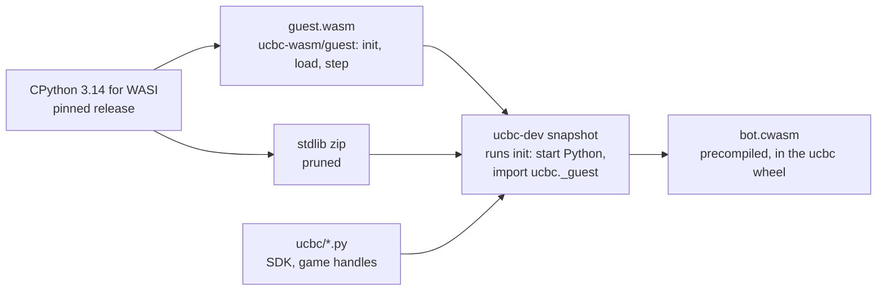
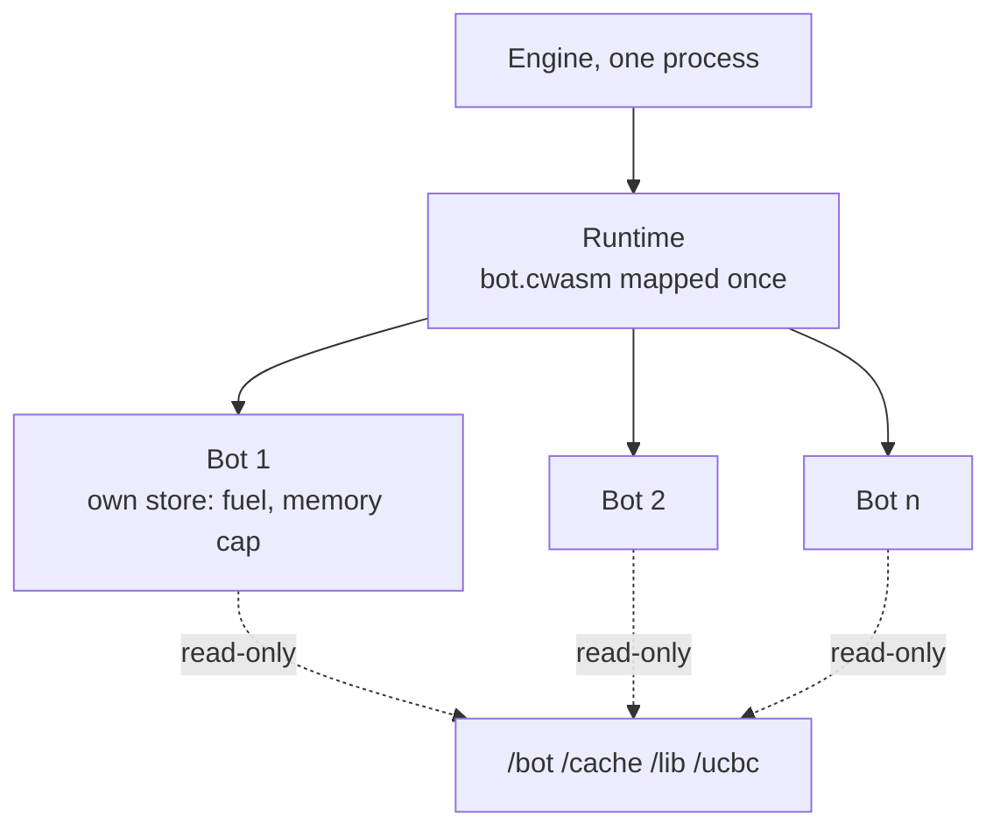
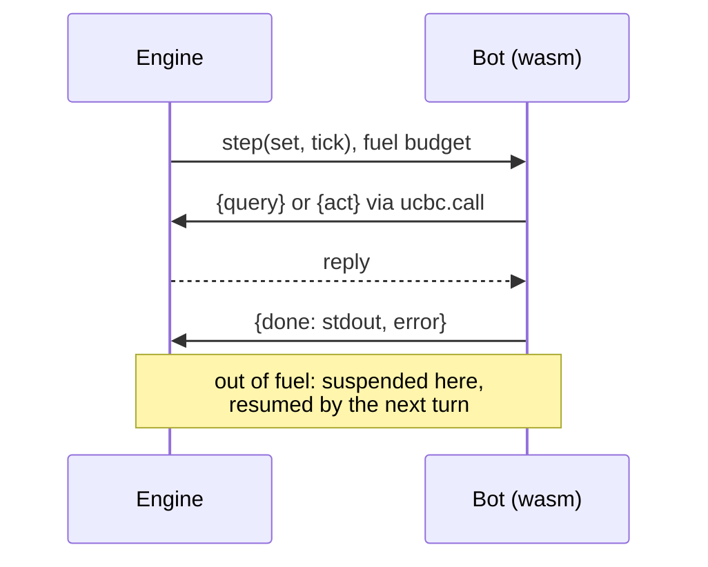

# Bot runtime: Python in WebAssembly

Each bot is one wasmtime instance of CPython built for WASI, inside the engine process:
crate `ucbc-wasm`, driven by `ucbc-cli/src/bot.rs`. The limits it enforces are in
`resourcelimits.md`.

## Build

`guest.wasm` is CPython linked with `ucbc-wasm/guest`, a reactor that exports `init`,
`compile`, `load` and `step` and imports `ucbc.call` and `ucbc.take`. `.github/workflows/guest.yml`
builds it and the stdlib zip and publishes both as a release; `make dev` downloads them
against the checksums in the Makefile, and `make guest` builds them locally instead.

`ucbc-dev snapshot` runs `init` under wizer and writes the started interpreter out
precompiled for the machine, `runtime/bot.cwasm` in the `ucbc` package. `init` imports
the whole standard library and freezes the heap, so a bot's stdlib imports cost it
nothing and its collections skip the snapshot's objects. A bot can import only what the
snapshot holds and its own modules; `ucbc._guest` lists what is left out: what cannot
import under WASI and what would reach outside the sandbox (processes, sockets,
signals, terminals). The engine maps
it once; every bot is an instance of it and shares its pages until it writes to them. A
precompiled module records the wasmtime features of the engine that compiled it, so the
snapshot step and the engine must be built with the same ones.

## A match

Before a team's first bot, one throwaway instance runs `compile`: every module under
`/bot` to bytecode in `/cache`, a directory the engine keeps for the match. Its bots
mount `/cache` read-only and load bytecode, so `load` runs `main.py` rather than
compiling it. A module that does not compile is left for the bot to import from
source, which reports the error as before.

## A step

- Time is fuel: wasm instructions, a budget per call, the same count on every machine.
  A call that runs out is suspended and the next turn resumes it. `time.perf_counter`
  reads fuel spent; `time.sleep` raises.
- Memory is a cap on the bot's linear memory, interpreter included. The allocation that
  would cross it raises `MemoryError`.
- A bot sees `/bot`, `/cache`, `/lib` and `/ucbc` read-only, seeded randomness, and
  nothing else: no network, no other files, no real clock.
- Loading `main.py` is `load`, once per bot, on the same fuel budget as a step; the
  team's bytecode was compiled beforehand, on no budget.
